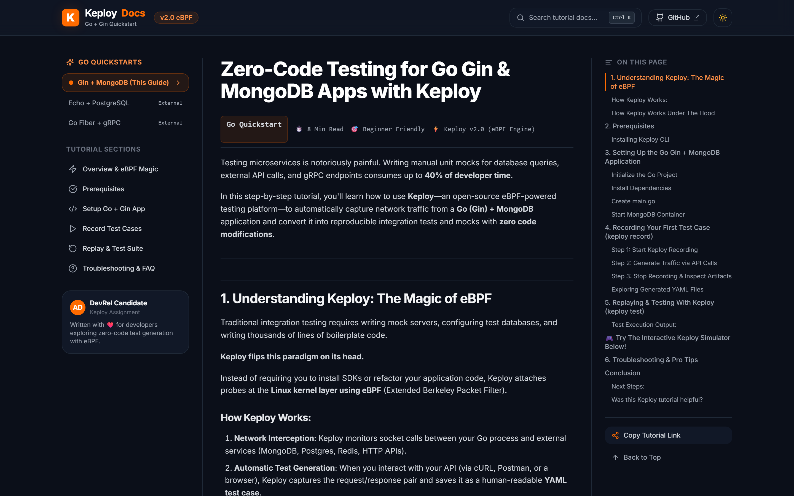
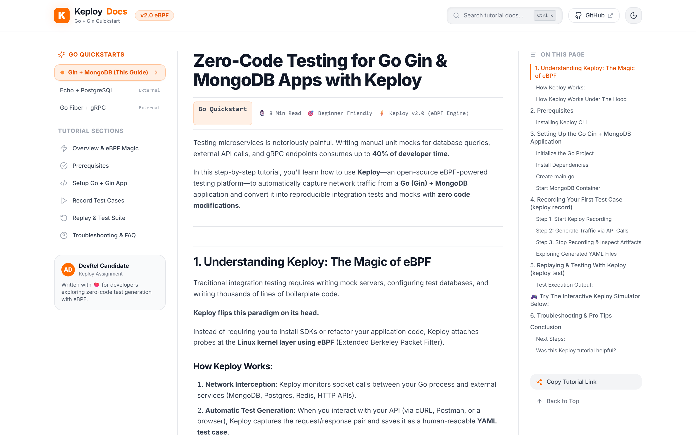
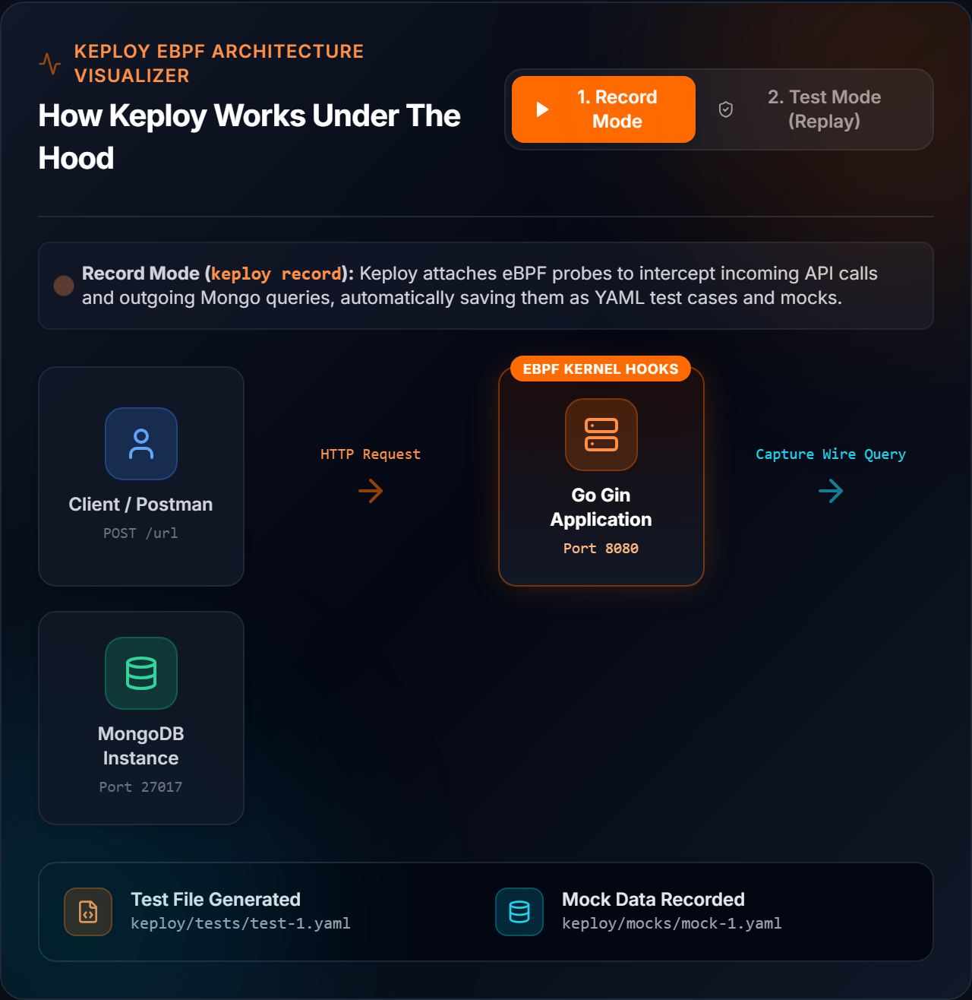
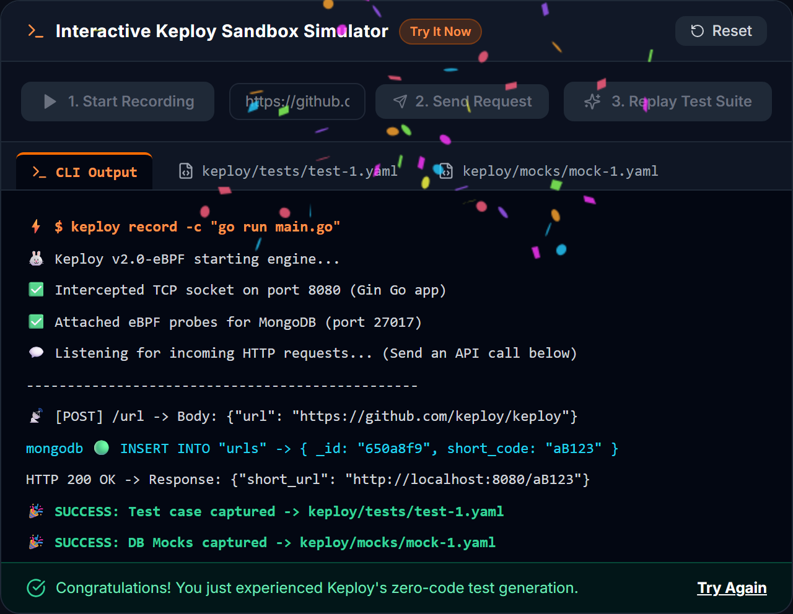
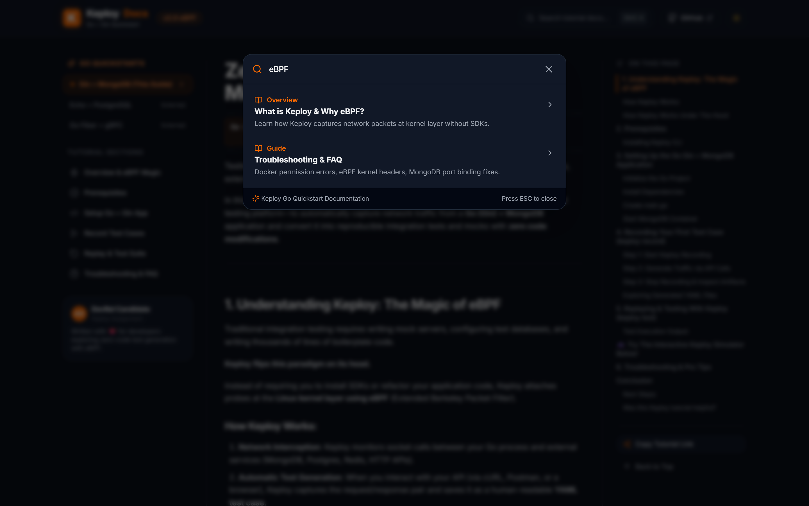
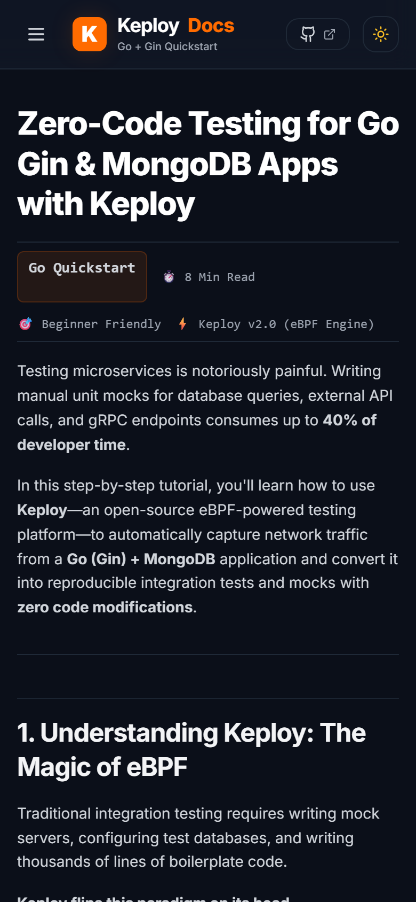

<div align="center">

# 🐰 Keploy Go Quickstart Documentation Portal

**Interactive eBPF-Powered Testing Guide for Go (Gin) & MongoDB REST APIs**

[](https://nextjs.org/)
[](https://mdxjs.com/)
[](https://tailwindcss.com/)
[](https://www.typescriptlang.org/)
[](https://keploy.io/)
[](LICENSE)

[🌐 **Live Demo on Vercel**](https://vercel.com) • [📖 **Tutorial Content**](#-tutorial-overview) • [✨ **Key Features**](#-key-features--uiux-highlights) • [🛠️ **Quickstart**](#-getting-started-locally)

---

### 🌟 Dark & Light Mode Experience

| Dark Mode (Default) | Light Mode |
| :---: | :---: |
|  |  |

</div>

---

## 📌 Project Overview

This repository contains a modern, developer-centric documentation portal built for the **Keploy DevRel Candidate Assignment**.

It presents an end-to-end tutorial guiding backend developers through testing a **Go (Gin) + MongoDB REST API** with **zero manual code modification** or test script writing using **Keploy's eBPF kernel engine**.

Rather than presenting static text, this application combines **MDX rendering**, **interactive eBPF architecture visualizers**, an **in-browser CLI sandbox simulator**, **Cmd/Ctrl+K instant search**, and **seamless theme switching** to deliver an engaging developer learning experience.

---

## 📸 Web Page Screenshots & Interactive Demos

### 1. ⚡ Interactive eBPF Architecture Visualizer
> Visualizes how Keploy intercepts network packets at the OS kernel level, routes traffic, and mocks MongoDB wire protocol automatically.



---

### 2. 💻 In-Browser Interactive CLI Sandbox Simulator
> An interactive playground allowing developers to simulate `keploy record`, send sample API payloads, view generated `test-1.yaml` / `mock-1.yaml` files in real-time, and replay test suites with confetti celebrations!



---

### 3. 🔍 Instant Search Engine (`Cmd/Ctrl + K`)
> Keyboard-accessible fuzzy search modal indexing headings, code examples, and technical concepts across the documentation.



---

### 4. 📱 Mobile-First Responsive Interface
> Fully optimized UI featuring collapsible drawer navigation, readable typography, and responsive code blocks on all viewports.

<div align="center">
  
</div>

---

## ✨ Key Features & UI/UX Highlights

- ⚡ **MDX-Driven Engine**: Seamlessly embeds interactive React components directly inside technical Markdown content.
- 🎨 **Dark & Light Mode Switcher**: Smooth theme transitions powered by `next-themes` and CSS HSL color tokens.
- 🔍 **Global Search Modal (`Cmd/Ctrl + K`)**: Instant search overlay for quick navigation across all sections.
- 🧬 **Interactive eBPF Flowchart**: Toggle between *Record Mode* and *Test Mode* to inspect request flow & mock generation.
- 🧪 **Interactive CLI Simulator**: Hands-on sandbox demonstrating `keploy record` and `keploy test` without needing Docker or Linux locally.
- 💻 **Multi-OS Execution Switcher**: Tabbed OS switcher for Linux, macOS, and Windows (WSL2) setup commands.
- 📋 **One-Click Code Snippets**: Syntax highlighting with copy-to-clipboard buttons and inline language badges.
- 📍 **Active Table of Contents**: Real-time heading observer highlighting reading progress as you scroll.
- ❓ **Troubleshooting Accordion**: Expandable FAQs covering eBPF kernel permissions, Docker networks, and noise filtering.
- 🎉 **Feedback & Rating Widget**: Interactive user sentiment widget with instant confetti feedback.

---

## 💡 Why Keploy & eBPF? (Technical "Why")

Traditional unit & integration testing for Go microservices requires:
1. Writing verbose unit tests with complex mocks (`gomock`, `testcontainers`).
2. Maintaining database seed scripts and test data fixtures.
3. Updating test suites every time an API schema or DB query changes.

### How Keploy Solves This:
- **Kernel-Level Packet Interception**: Keploy uses **eBPF (Extended Berkeley Packet Filter)** probes attached to Linux kernel sockets.
- **Zero Code Changes**: You don't need to import any SDKs or rewrite `main.go`.
- **Automatic Mock Generation**: Keploy inspects MongoDB wire-protocol packets (port `27017`) and automatically records requests/responses into YAML mocks (`keploy/mocks/mock-1.yaml`).
- **Deterministic Replay**: During `keploy test`, Keploy intercepts outgoing DB calls and serves stored responses—allowing fast, isolated testing without altering live database data.

---

## 🛠️ Project Tech Stack

| Component | Technology Used | Description |
| :--- | :--- | :--- |
| **Framework** | Next.js 14 (App Router) | React framework with server component rendering & routing |
| **Content Engine** | `@next/mdx` / `next-mdx-remote` | Dynamic compilation of MDX content into React components |
| **Styling** | Tailwind CSS v3.4 | Utility-first responsive CSS styling with custom animations |
| **Theme Management** | `next-themes` | Dark / Light mode switching with zero flash of unstyled content |
| **Animations** | `framer-motion` | Smooth transition effects and modal overlays |
| **Icons & Micro-UI** | `lucide-react` | Clean SVG icon system |
| **Testing / Screenshot Automation** | `playwright` | Automated headless browser screenshot capture script |

---

## 🚀 Getting Started Locally

### Prerequisites
- **Node.js**: `v18.0.0` or higher
- **npm**: `v9.0.0` or higher

### Installation

1. **Clone the repository**:
   ```bash
   git clone https://github.com/Amanarun2907/Keploy_DevRel_Assignment_Aman_Jain.git
   cd Keploy_DevRel_Assignment_Aman_Jain
   ```

2. **Install dependencies**:
   ```bash
   npm install
   ```

3. **Start the development server**:
   ```bash
   npm run dev
   ```

4. **Open in browser**:
   Navigate to [http://localhost:3000](http://localhost:3000) to view the live documentation site.

---

## 📸 Automated Screenshot Capture Tool

This repository includes an automated screenshot capture script using **Playwright**. To re-generate all high-resolution web page screenshots in `public/screenshots/`:

```bash
# Ensure dev server is running, or start it in another terminal:
npm run dev

# Run screenshot capture:
node scripts/capture-screenshots.js
```

---

## 🏗️ Project Structure

```
├── public/
│   └── screenshots/              # High-res web page screenshots
│       ├── hero-dark.png         # Dark mode hero header
│       ├── hero-light.png        # Light mode hero header
│       ├── ebpf-architecture.png # eBPF visualizer component
│       ├── cli-simulator.png    # In-browser CLI sandbox
│       ├── search-modal.png     # Cmd+K search modal overlay
│       ├── mobile-view.png      # Mobile view
│       └── fullpage-dark.png    # Full page preview
├── scripts/
│   └── capture-screenshots.js    # Playwright automation script
├── src/
│   ├── app/
│   │   ├── globals.css           # Custom HSL variables, glassmorphism & syntax styles
│   │   ├── layout.tsx            # Root layout with Header, Sidebar, TOC & Footer
│   │   ├── page.tsx              # MDX renderer with custom component mappings
│   │   └── providers.tsx         # Next-themes provider
│   ├── components/
│   │   ├── mdx/                  # Custom interactive MDX components
│   │   │   ├── Accordion.tsx              # Collapsible FAQ accordion
│   │   │   ├── Callout.tsx                # Info / Warning / Tip alerts
│   │   │   ├── CodeBlock.tsx              # Copyable code block with language badge
│   │   │   ├── InteractiveArchitecture.tsx# eBPF workflow visualizer
│   │   │   ├── InteractiveTestSimulator.tsx# In-browser CLI sandbox
│   │   │   ├── Steps.tsx                  # Numbered workflow steps
│   │   │   └── Tabs.tsx                   # OS / CLI command tabs
│   │   └── ui/                   # Global layout UI elements
│   │       ├── FeedbackWidget.tsx         # Rating & confetti feedback
│   │       ├── Footer.tsx                 # Site footer
│   │       ├── Header.tsx                 # Top navigation bar & theme toggle
│   │       ├── SearchModal.tsx            # Cmd+K search overlay
│   │       ├── Sidebar.tsx                # Left documentation navigation
│   │       └── TableOfContents.tsx        # Right heading active observer
│   └── content/
│       └── keploy-go-quickstart.mdx       # Complete Go + Gin + Mongo MDX tutorial
├── next.config.mjs
├── tailwind.config.ts
├── tsconfig.json
└── package.json
```

---

## 🎯 DevRel Assignment Evaluation Criteria Checklist

| Requirement | Status | Details |
| :--- | :---: | :--- |
| **Next.js Framework** | ✅ | Built with Next.js 14 App Router |
| **MDX Integration** | ✅ | MDX content blending Markdown and custom React components |
| **Go Quickstart Guide** | ✅ | Deep-dive Gin + Mongo URL shortener quickstart tutorial |
| **Interactive UI Elements** | ✅ | Interactive Architecture visualizer & CLI sandbox simulator |
| **Dark & Light Mode Toggle** | ✅ | Theme switcher powered by `next-themes` |
| **High-Quality UI/UX** | ✅ | Glassmorphism, smooth animations, Cmd+K search, responsive design |
| **Documentation Screenshots** | ✅ | High-resolution screenshots added in `public/screenshots/` and `README.md` |
| **Clean Repo & Setup** | ✅ | Fully documented installation and deployment workflow |

---

## 🌐 Deployment to Vercel

1. Push your repository to GitHub:
   ```bash
   git add .
   git commit -m "Update README with screenshots and project documentation"
   git push origin main
   ```

2. Import repository into [Vercel Dashboard](https://vercel.com/new).
3. Vercel will automatically detect Next.js settings. Click **Deploy**.

---

## 📄 License

Distributed under the **MIT License**. See `LICENSE` for more information.

---

<div align="center">
  <sub>Built with ❤️ by <strong>Aman Jain</strong> for the <strong>Keploy DevRel Candidate Assignment</strong>.</sub>
</div>
